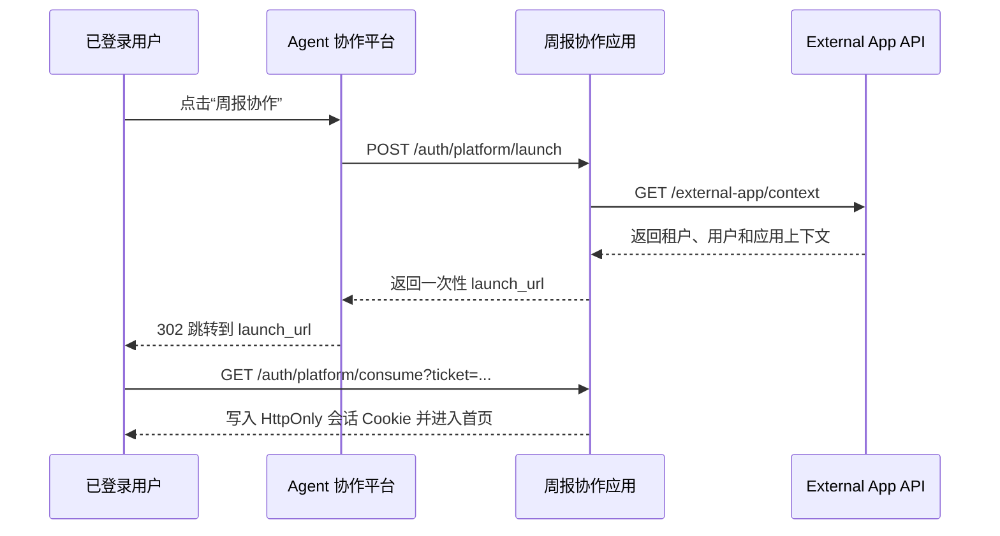

# 周报协作

当前版本：`v1.4`

周报协作是一个独立部署、由 Agent 协作平台启动的周报业务应用。用户可以提交“本周工作 / 下周计划”和附件；具备审阅权限的成员可以查看、评论并发起 Agent 分析。周报、权限快照、附件、评论、消息和分析结果全部保存在本应用中，平台只提供用户身份、组织关系和个人 Agent 能力。

> 本应用没有独立登录页。部署者可以选择安全的一次性票据模式，或直接在 URL 中拼接用户 ID 的简化模式；正式生产默认并推荐使用票据模式。

## 一、生产部署

### 1. 部署前准备

需要准备：

- Node.js 22 或 Docker。
- 一个可由用户和平台服务端访问的 HTTPS 域名，例如 `https://weekly.example.com`。
- 平台分配的 External App API 地址、API Key、租户 ID 和业务应用 Key。
- 使用票据模式时，准备平台与本应用共享的启动密钥，至少 32 位随机字符。
- 可持久化的 SQLite 数据目录和附件目录。
- 生产可用的 ClamAV `clamd` 服务。
- 单实例部署；当前版本不支持多个实例同时写同一个 SQLite 文件。

### 2. 生产环境变量

复制 [.env.example](./.env.example) 并创建不提交到 Git 的 `.env.production`：

```env
NODE_ENV=production
PORT=3001
DATA_DIR=/app/data
UPLOAD_DIR=/app/uploads

NEXUSOS_API_BASE_URL=https://platform.example.com/api/v1
NEXUSOS_API_KEY=<平台分配的服务端 API Key>
NEXUSOS_TENANT_ID=<租户 ID>
NEXUSOS_APP_KEY=<外部应用 Key>

APP_PUBLIC_URL=https://weekly.example.com
PLATFORM_ENTRY_MODE=ticket
PLATFORM_LAUNCH_SECRET=<至少 32 位随机值>
LAUNCH_TICKET_TTL_SECONDS=120
SESSION_TTL_HOURS=8
SESSION_COOKIE_NAME=weekly_session

CORS_ALLOWED_ORIGINS=https://platform.example.com
FRAME_ANCESTORS='self' https://platform.example.com

CLAMAV_HOST=clamav.internal
CLAMAV_PORT=3310
CLAMAV_TIMEOUT_MS=15000

PLATFORM_TIMEOUT_MS=20000
RATE_LIMIT_PER_MINUTE=180
AGENT_RATE_LIMIT_PER_MINUTE=6
```

注意：

- `PLATFORM_ENTRY_MODE` 可选 `ticket` 或 `url_user_id`，默认 `ticket`。
- `NEXUSOS_API_KEY` 和 `PLATFORM_LAUNCH_SECRET` 是两种不同的密钥；后者只在 `ticket` 模式必填。
- 所有密钥只能放在服务端环境变量或密钥管理服务中，不得进入前端、URL、日志或 Git。
- `APP_PUBLIC_URL` 在生产环境必须是 HTTPS。
- `ENABLE_LOCAL_TEST_ENTRY` 不要配置在生产环境；即使误配，生产模式也不会启用测试入口。
- 如果平台只做顶层页面跳转，不需要跨域调用业务 API，`CORS_ALLOWED_ORIGINS` 仍需按服务端生产校验填写可信来源。

### 3. 使用 Docker 部署（推荐）

```bash
docker build -t weekly-review-platform:v1.4 .

docker run -d \
  --name weekly-review-platform \
  --restart unless-stopped \
  -p 3001:3001 \
  --env-file .env.production \
  -v weekly-data:/app/data \
  -v weekly-uploads:/app/uploads \
  weekly-review-platform:v1.4
```

必须持久化：

- `/app/data`：SQLite 数据库。
- `/app/uploads`：周报附件。

容器健康检查使用：

```text
GET /api/ready
```

生产环境建议在容器前配置 Nginx、Traefik 或平台网关，由网关负责 HTTPS、访问日志和请求大小限制。

### 4. 使用 Node.js 部署

```bash
npm ci
npm run build
node --env-file=.env.production dist-server/index.js
```

如果由 systemd、Docker Compose、Kubernetes 或进程管理器注入环境变量，也可以执行：

```bash
npm start
```

构建完成后，Express 在同一端口提供前端静态文件和业务 API。

### 5. 部署后检查

```bash
curl https://weekly.example.com/api/health
curl https://weekly.example.com/api/ready
```

预期响应：

```json
{"status":"ok","service":"nexus-weekly"}
```

```json
{"status":"ready","database":"ok","uploads":"ok"}
```

随后必须按所选入口模式从平台发起一次真实用户启动，验证：

1. 平台能够申请一次性启动地址。
2. 浏览器跳转后能够建立会话并进入首页。
3. 提交周报时能够读取组织关系。
4. Agent 配置页能够读取当前用户的 Agent。
5. Agent 分析能够成功返回结果。

## 二、平台如何启动本应用

### 入口模式怎么选

| 模式 | 配置 | 平台调用方式 | 适用场景 |
| --- | --- | --- | --- |
| 一次性票据（默认、推荐） | `PLATFORM_ENTRY_MODE=ticket` | 平台后端调用 `/auth/platform/launch`，再跳转返回的地址 | 公网或正式生产 |
| URL 用户 ID（简单） | `PLATFORM_ENTRY_MODE=url_user_id` | 直接打开 `https://weekly.example.com/?user_id=<用户ID>` | 内网演示，或平台网关已阻止外部直访 |

两种模式都会调用平台 `/external-app/context`，核对租户、用户 ID 和应用 Key。区别在于：票据模式能证明启动请求来自持有共享密钥的平台；URL 模式不能证明访问者本人就是 URL 中的用户，因此安全边界必须由平台网关承担。

### 模式 A：一次性启动票据



### 1. 平台服务端申请启动地址

平台后端调用：

```http
POST https://weekly.example.com/auth/platform/launch
Authorization: Bearer <PLATFORM_LAUNCH_SECRET>
Content-Type: application/json

{
  "tenant_id": "8133c675-3bb4-4ace-ba10-1e83299cf761",
  "user_id": "a3f0d748-5104-4703-a230-f5d3931a56b2",
  "redirect_path": "/"
}
```

要求：

- 只能由平台服务端调用，不能把启动密钥交给浏览器。
- `tenant_id` 必须与应用的 `NEXUSOS_TENANT_ID` 一致。
- `user_id` 必须来自平台已经验证的登录态。
- `redirect_path` 可省略，只接受应用内以 `/` 开头的相对路径。

成功时返回 HTTP `201`：

```json
{
  "launch_url": "https://weekly.example.com/auth/platform/consume?ticket=...",
  "expires_at": "2026-07-14T10:02:00.000Z"
}
```

平台服务端示例：

```js
async function createWeeklyLaunchUrl({ tenantId, userId }) {
  const response = await fetch(`${process.env.WEEKLY_APP_URL}/auth/platform/launch`, {
    method: "POST",
    headers: {
      Authorization: `Bearer ${process.env.WEEKLY_PLATFORM_LAUNCH_SECRET}`,
      "Content-Type": "application/json",
    },
    body: JSON.stringify({
      tenant_id: tenantId,
      user_id: userId,
      redirect_path: "/",
    }),
  });

  const body = await response.json();
  if (!response.ok) {
    throw new Error(body.error?.message || `Weekly app HTTP ${response.status}`);
  }
  return body.launch_url;
}
```

平台侧保存：

```env
WEEKLY_APP_URL=https://weekly.example.com
WEEKLY_PLATFORM_LAUNCH_SECRET=<与应用 PLATFORM_LAUNCH_SECRET 完全一致>
```

### 2. 平台跳转用户浏览器

平台拿到 `launch_url` 后，通过服务端 HTTP 302 或前端：

```js
location.assign(launchUrl);
```

将当前浏览器跳转到该地址。不要把 `launch_url` 长期写入日志或分析事件，因为它在有效期内代表一次登录机会。

启动票据：

- 默认 120 秒过期。
- 只能消费一次，重复访问返回 401。
- SQLite 只保存票据的 SHA-256 摘要。
- 消费后写入 HttpOnly、SameSite=Lax 会话 Cookie。
- 生产环境 Cookie 自动启用 Secure。
- 会话默认 8 小时有效。

当前推荐使用顶层页面跳转，或将应用部署在平台同站点的可信反向代理之后。若要跨站点 iframe 嵌入，仅配置 `FRAME_ANCESTORS` 还不够，还需要结合实际域名重新评估浏览器第三方 Cookie 策略。

### 模式 B：URL 直接拼接用户 ID

应用侧配置：

```env
PLATFORM_ENTRY_MODE=url_user_id
APP_PUBLIC_URL=https://weekly.example.com
```

平台无需调用启动接口，直接跳转：

```text
https://weekly.example.com/?user_id=a3f0d748-5104-4703-a230-f5d3931a56b2
```

也可以由平台前端生成：

```js
const target = new URL("https://weekly.example.com/");
target.searchParams.set("user_id", currentUser.id);
location.assign(target.toString());
```

应用处理流程：

1. 校验 `user_id` 格式。
2. 调用平台 `/external-app/context`，核对 `tenant_id`、`user_id` 和 `app_key`。
3. 创建本地 HttpOnly 会话 Cookie。
4. 返回 HTTP 303 跳转到 `/`，立即从地址栏移除 `user_id`。

安全限制：

- URL 中的 `user_id` 可以被访问者自行修改。
- `/external-app/context` 复核平台上下文，但不能证明浏览器访问者本人就是该用户。
- 只有当平台网关要求用户先登录、并且应用源站不能被外部绕过网关直接访问时，才可以在正式环境使用。
- 如果应用直接暴露在公网，必须使用 `ticket` 模式。

### 4. 应用如何调用平台 API

本应用服务端只调用以下 External App API：

| 时机 | 方法 | 平台路径 | 用途 |
| --- | --- | --- | --- |
| 创建平台启动票据、加载会话 | `GET` | `/external-app/context` | 复核租户、用户和应用上下文 |
| 提交周报 | `GET` | `/external-app/organization-graph?user_id=...` | 获取直接、间接及多条审阅关系 |
| 打开 Agent 配置或开始分析 | `GET` | `/external-app/agents?user_id=...` | 获取当前用户可调用的个人 Agent |
| 执行周报分析 | `POST` | `/external-app/agents/{agent_id}/runs` | 提交整理后的周报分析材料 |

每次请求由本应用服务端发出，并携带：

```http
Authorization: Bearer <NEXUSOS_API_KEY>
x-tenant-id: <NEXUSOS_TENANT_ID>
x-user-id: <当前平台用户 ID>
x-business-app-key: <NEXUSOS_APP_KEY>
x-request-id: <每次请求生成的 UUID>
Content-Type: application/json
```

Agent Run 的核心输入结构：

```json
{
  "user_id": "当前发起人 ID",
  "objective": "请输出一段中文自然语言文本，先对照上次计划与本次完成情况，再给出整体评价和改进建议；不要输出 JSON、表格或多个独立结果区块",
  "input": {
    "current_report": {
      "week": "2026-07-13",
      "title": "第 30 周周报",
      "current_work": "本周工作内容",
      "next_plan": "下周计划内容",
      "attachments": [
        {
          "file_name": "项目进展.xlsx",
          "text_preview": "应用提取的附件文本"
        }
      ]
    },
    "history_reports": [],
    "previous_plan_follow_up": {
      "previous_week": "2026-07-06",
      "previous_plan": "上次周报中的下周计划",
      "current_week": "2026-07-13",
      "current_work": "本次周报中的本周工作"
    },
    "comments": []
  },
  "mode": "task",
  "runtime_hint": { "provider": "eap_native" },
  "inject_context": false,
  "inject_memories": true,
  "capture_memory": true
}
```

其中 `inject_memories: true` 会在分析时注入当前用户可用的个人 Agent 记忆，`capture_memory: true` 允许平台将本次分析结果写回该用户的 Agent 记忆。应用不注入平台通用上下文，因此 `inject_context` 仍为 `false`。启用后，周报分析内容可能进入平台的个人记忆存储，生产部署时应同步纳入隐私告知与数据保留策略。

完整 External App API 契约见 [external-app-api-reference..md](./external-app-api-reference..md)，应用启动协议的独立说明见 [docs/platform-launch-integration.md](./docs/platform-launch-integration.md)。

### 可选流程：可信反向代理

如果平台网关反向代理本应用，可以配置：

```env
TRUSTED_IDENTITY_HEADER=x-authenticated-user-id
TRUSTED_PROXY_SECRET_HEADER=x-trusted-proxy-secret
TRUSTED_PROXY_SECRET=<至少 32 位随机值>
```

网关必须先删除浏览器传入的同名请求头，验证平台登录态，再注入真实用户 ID 和代理密钥。不要让浏览器直接持有代理密钥。

## 三、功能概览

- 分别填写“本周工作”和“下周计划”。
- 每份周报最多上传 5 个附件，单个附件不超过 10 MB。
- 提交时读取平台组织关系并创建不可越权的权限快照。
- “我的周报”和“审阅周报”支持关键词、人员和日期筛选。
- 审阅页分为“待审阅 / 已审阅”。
- 评论后自动产生消息提醒，支持单条已读和全部已读。
- 作者和具备查看权限的成员都可以发起 Agent 分析。
- 用户可以从平台返回的个人 Agent 列表中选择分析 Agent。
- Agent 会先对照最近一份历史周报的下周计划与本次完成情况，再结合附件、历史内容和已有评论，在同一个结果卡片中返回一块自然语言文本。
- 支持中文附件名、附件文本提取、安全下载和级联删除。
- 提供持久化 Agent 任务、操作审计、限流、备份和恢复。

## 四、系统边界

平台负责：

- 用户登录、用户 ID 和租户上下文。
- 组织关系图。
- 当前用户可使用的个人 Agent。
- Agent 运行能力。

本应用负责：

- 周报、附件、权限快照、评论和消息。
- 附件校验、病毒扫描和文本提取。
- Agent 分析材料整理、任务状态和分析结果。
- SQLite 数据迁移、审计、备份和恢复。

本应用不会把周报、附件或评论写回平台，也不会自行修改平台组织关系。

## 五、本地开发与演示

### Windows 一键启动

安装 Node.js 22 后执行：

```powershell
.\start-server.bat
```

脚本会安装依赖、构建项目、启动本地平台 mock 和应用，并按照 `PLATFORM_ENTRY_MODE` 选择票据入口或 URL 用户 ID 入口打开浏览器。

> `start-server.bat` 会启动 mock，只用于本地开发和演示，不用于生产部署。

切换展示用户：

```powershell
$env:WEEKLY_LAUNCH_USER_ID="3"
.\start-server.bat
```

测试 URL 用户 ID 模式：

```powershell
$env:PLATFORM_ENTRY_MODE="url_user_id"
$env:WEEKLY_LAUNCH_USER_ID="3"
.\start-server.bat
```

### 手动启动

终端一：

```powershell
cd tools\external-app-api-mock
npm start
```

终端二：

```powershell
npm install
npm run dev
```

- 前端开发服务器：`http://localhost:5173`
- Express API：`http://localhost:3001`
- 平台 mock：`http://localhost:18080`

写入幂等演示数据：

```powershell
npm run seed:demo
```

本地测试入口仅在非生产模式、显式设置 `ENABLE_LOCAL_TEST_ENTRY=true` 且请求来自本机回环地址时可用：

```text
http://localhost:3001/auth/local-test-entry?user_id=3
```

## 六、数据、附件与事务

关键数据表：

- `reports`：周报标题、本周工作和下周计划。
- `report_access`：作者与审阅人的权限快照。
- `attachments`：附件元数据、路径和文本预览。
- `comments`、`comment_reads`：评论与消息已读状态。
- `agent_jobs`、`agent_analyses`：Agent 任务与结果。
- `user_agent_preferences`：用户选择的个人 Agent。
- `platform_launch_tickets`、`app_sessions`：启动票据和会话。
- `audit_events`：关键业务操作审计。

SQLite 使用 WAL 和外键约束。提交周报时，周报、权限快照和附件元数据在同一个数据库事务内写入；事务失败会回滚数据库并清理已暂存附件。删除周报会通过外键级联删除评论、消息、附件元数据和 Agent 记录，再清理附件文件。

组织关系在提交时固化为权限快照。后续组织变化不会自动改变历史周报权限；如果业务要求实时撤权，需要增加组织变更同步和历史权限重算任务。

附件支持：`.txt`、`.md`、`.csv`、`.json`、`.log`、`.xml`、`.html`、`.xlsx`、`.xls`、`.docx`、`.pdf`。服务端会校验扩展名、文件签名、文件数、大小，并在生产环境调用 ClamAV。

## 七、测试与常用命令

```powershell
npm run typecheck
npm test
npm run test:ui-style
npm run test:e2e
npm run build
```

端到端测试使用独立临时数据库和严格平台 mock，覆盖：

- 平台启动、票据防重放、会话和退出。
- 平台 API 请求头、用户身份和 Agent 请求体契约。
- 双栏周报、中文附件上传、提取和下载。
- 直接、间接及多条审阅关系。
- 搜索筛选、评论、消息和已读状态。
- 作者与审阅人 Agent 分析。
- 重复提交、伪造附件、越权访问拒绝。
- 事务中途失败回滚、附件清理、级联删除和外键完整性。

| 命令 | 用途 |
| --- | --- |
| `npm run dev` | 启动前端和 API 开发服务 |
| `npm run seed:demo` | 写入演示数据 |
| `npm run typecheck` | 检查前后端 TypeScript |
| `npm test` | 运行单元测试 |
| `npm run test:ui-style` | 运行 UI 样式回归检查 |
| `npm run test:e2e` | 运行隔离端到端测试 |
| `npm run build` | 构建生产前端和服务端 |
| `npm start` | 运行已构建服务，环境变量需提前注入 |
| `npm run backup` | 备份 SQLite 与附件 |
| `npm run restore -- <目录>` | 恢复指定备份 |

## 八、备份、恢复与扩展限制

备份：

```powershell
$env:BACKUP_DIR="D:\weekly-backups"
npm run backup
```

恢复前必须停止应用：

```powershell
npm run restore -- D:\weekly-backups\2026-07-14T10-00-00-000Z
```

生产环境应把备份同步到独立存储，并定期进行恢复演练。

当前 SQLite 与本地附件方案适用于单实例、低到中等并发的内部应用。需要水平扩展时，应先将 SQLite 迁移到 PostgreSQL、附件迁移到对象存储、Agent 任务迁移到独立队列，并接入集中日志、指标、告警和密钥管理。

## 九、项目结构

```text
.
├─ src/                          React 前端
├─ server/                       Express、SQLite、认证和平台客户端
├─ docs/                         平台启动接入说明
├─ scripts/                      测试、演示、备份、恢复和构建脚本
├─ tools/external-app-api-mock/  本地 External App API mock
├─ data/                         SQLite 数据目录，运行时生成
├─ uploads/                      附件目录，运行时生成
├─ external-app-api-reference..md
├─ .env.example
├─ Dockerfile
└─ start-server.bat
```

## 许可证

仓库当前未声明开源许可证。对外分发前，请由项目所有者补充许可证和第三方依赖合规说明。
