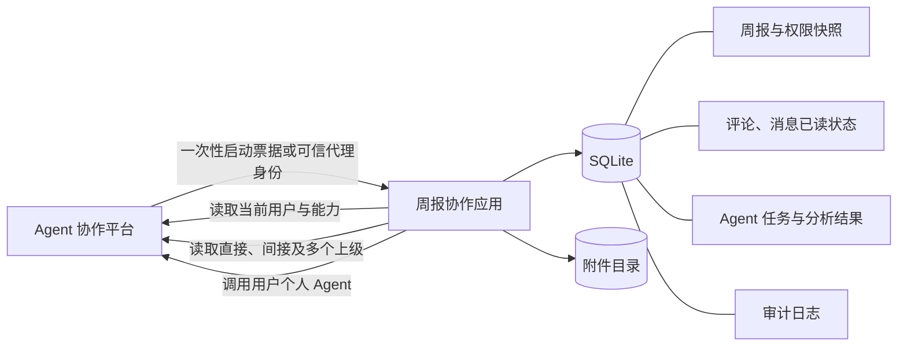

# 周报协作

当前版本：`v1.2`

## 项目简介

周报协作是一个与 Agent 协作平台解耦的业务应用。员工可以提交周报和附件，上级根据组织关系查看并评论下属周报；应用同时提供评论消息提醒、历史周报搜索，以及结合历史内容、附件和上级反馈的 Agent 智能分析。周报、权限、附件和评论等业务数据均由本应用独立保存。

## 功能概览

- 员工分别填写“本周工作”和“下周计划”后提交周报，并可上传最多 5 个附件，单个附件不超过 10 MB。
- 提交时读取平台组织关系，自动覆盖直接上级、间接上级和多个上级。
- 作者查看自己的历史周报；上级只查看权限表内允许审阅的周报。
- 上级发表评论后，作者会收到消息提醒，支持单条已读和全部已读。
- 作者和有查看权限的上级都可以发起 Agent 分析。
- 用户可从平台返回的个人 Agent 列表中选择并保存周报分析 Agent。
- Agent 会结合本次周报、附件文本、作者最近 8 份历史周报和历史评论给出建议。
- “我的周报”和“审阅周报”均支持按关键词、提交人和周报日期范围搜索；审阅页按“待审阅 / 已审阅”分区展示。
- 支持中文附件名、附件文本提取、附件下载、周报删除和关联数据清理。
- 提供响应式前端、SQLite 持久化任务、操作审计、限流、安全响应头、备份与恢复脚本。
- 不提供独立登录页；平台通过一次性启动票据或可信反向代理传递已认证用户身份。

### v1.2 主要变化

- 新增“我的消息”、未读红点、评论定位和全部已读。
- 移除浏览器用户 ID 模拟入口，改为平台服务端启动票据和 HttpOnly 应用会话。
- 新增三级演示用户 `1 → 2 → 3` 及对应周报数据。
- 上级可使用自己的个人 Agent 分析有权查看的周报。
- 新增 Agent 配置页，可读取平台当前用户的可调用 Agent 并保存个人选择。
- 新增全部周报档案及关键词、人员、日期组合筛选。
- 完善归档页、侧边栏、详情页和交互反馈。

## 系统边界



平台负责：

- 用户身份与租户上下文。
- 组织关系图。
- 当前用户可使用的个人 Agent。
- Agent 运行能力。

本应用负责：

- 周报、附件、评论和消息的完整业务流程。
- 根据提交时组织关系生成周报可见权限。
- 附件文本提取与 Agent 输入组装。
- Agent 任务状态、分析结果、审计、备份和恢复。

本应用不会把周报、附件或评论写回平台，也不会自行维护平台组织关系。

## 核心业务流程

### 提交与授权

1. 用户在平台完成登录，平台服务端申请一次性启动地址并将浏览器跳转到应用。
2. 用户提交周报和附件。
3. 服务端校验周报内容、附件类型、文件签名和文件大小。
4. 服务端调用组织关系 API，获取当前用户全部直接和间接上级。
5. 应用保存周报，并将作者及所有上级写入 `report_access` 权限快照。
6. 上级进入应用时，服务端按权限表返回可审阅周报。

### 评论与消息

1. 有查看权限的上级在周报详情中发表评论。
2. 评论保存在本地 `comments` 表。
3. 作者的“我的消息”出现通知和未读红点。
4. 打开通知会跳转到对应周报的评论区并记录已读状态。

### Agent 分析

1. 作者或有查看权限的上级发起分析。
2. 应用分别查询本次和历史周报的“本周工作 / 下周计划”，并补充附件文本与历史评论。
3. 应用查询发起人的个人 Agent，并创建持久化分析任务。
4. 后台任务调用平台 Agent API；失败任务按配置重试，服务重启后可继续处理。
5. 前端轮询任务状态并展示分析结果。

## 技术栈

| 层级 | 技术 |
| --- | --- |
| 前端 | React 19、TypeScript、Vite、Lucide Icons |
| 服务端 | Node.js 22、Express 5、TypeScript |
| 数据库 | SQLite、better-sqlite3、WAL 模式 |
| 文件解析 | XLSX、Mammoth、PDF Parse |
| 测试 | Vitest、独立 mock 端到端测试 |
| 部署 | 单进程 Node.js 或 Docker |

## 快速开始

### Windows 一键启动

安装 Node.js 后，可以直接双击项目根目录的 `start-server.bat`，或在 PowerShell 中执行：

```powershell
.\start-server.bat
```

脚本会检查依赖、构建最新代码、启动平台 mock 与周报服务器，并以本地平台服务端身份申请一次性启动地址后打开浏览器。页面中不再提供用户 ID 输入入口。

### 环境要求

- Node.js 22 或更高版本。
- npm。
- Windows PowerShell、macOS 或 Linux 终端。

### 1. 安装依赖

```powershell
cd D:\agent
npm install
```

### 2. 启动平台 mock

```powershell
cd D:\agent\tools\external-app-api-mock
npm start
```

mock 默认运行在 `http://localhost:18080`。

### 3. 启动应用开发环境

在另一个终端执行：

```powershell
cd D:\agent
npm run dev
```

- 前端：`http://localhost:5173`
- 业务 API：`http://localhost:3001`

直接访问页面但没有平台会话时，应用会提示从平台打开。开发时推荐使用 `start-server.bat`；它通过与生产相同的启动接口建立本地会话。

需要手动进入本地测试身份时，可在启动服务前设置 `ENABLE_LOCAL_TEST_ENTRY=true`，然后访问：

```text
http://localhost:3001/auth/local-test-entry?user_id=3
```

该入口只在非生产环境且请求来自本机回环地址时生效，生产环境始终返回 404。

### 4. 写入展示数据

保持 mock 和应用运行，然后执行：

```powershell
npm run seed:demo
```

脚本可重复运行，不会重复创建同一用户同一周的周报。

## 演示用户

mock 中的展示组织关系为：

```text
用户 1 → 用户 2 → 用户 3
```

| 用户 ID | 展示内容 | 预期统计 |
| --- | --- | --- |
| `1` | 仅本人周报 | 我的周报 13，审阅周报 0 |
| `2` | 仅审阅用户 1 | 我的周报 0，审阅周报 13 |
| `3` | 本人周报并间接审阅用户 1 | 我的周报 2，审阅周报 13 |

设置 `WEEKLY_LAUNCH_USER_ID` 后运行 `start-server.bat`，即可验证对应身份。例如：

```powershell
$env:WEEKLY_LAUNCH_USER_ID="3"
.\start-server.bat
```

## 平台 API 依赖

应用只调用以下平台接口：

| 方法 | 平台路径 | 用途 |
| --- | --- | --- |
| `GET` | `/external-app/context` | 读取当前租户、用户与应用能力 |
| `GET` | `/external-app/organization-graph?user_id=...` | 获取用户及其全部上级路径 |
| `GET` | `/external-app/agents?user_id=...` | 查询发起人的个人 Agent |
| `POST` | `/external-app/agents/{agent_id}/runs` | 提交周报分析任务 |

请求由服务端发出，并携带平台 API Key、租户 ID、用户 ID 和业务应用 Key。详细平台契约见 [external-app-api-reference..md](./external-app-api-reference..md)。

## 身份传递

本应用不提供登录页面，也不接受浏览器发送的 `x-user-id`。推荐流程为：

1. 用户在 NexusOS 平台完成登录并点击周报应用。
2. 平台服务端携带共享启动密钥调用 `POST /auth/platform/launch`，传入可信的 `tenant_id` 和 `user_id`。
3. 应用调用平台 `/external-app/context` 复核租户、用户和应用上下文。
4. 应用返回默认 120 秒有效、只能使用一次的 `launch_url`。
5. 平台将当前浏览器跳转到该地址。
6. 应用消费票据并写入 HttpOnly、SameSite=Lax 会话 Cookie，然后进入主页面。

完整请求格式、平台服务端示例和可信反向代理备选方案见 [平台启动接入文档](./docs/platform-launch-integration.md)。

`PLATFORM_LAUNCH_SECRET`、`TRUSTED_PROXY_SECRET` 和 `NEXUSOS_API_KEY` 只能保存在服务端，不得写入前端构建、浏览器存储、URL 或公开仓库。

## 应用 API

所有业务数据查询都会再次执行服务端权限校验。

| 方法 | 路径 | 用途 |
| --- | --- | --- |
| `POST` | `/auth/platform/launch` | 平台服务端申请一次性用户启动地址 |
| `GET` | `/auth/platform/consume` | 浏览器消费启动票据并建立 HttpOnly 会话 |
| `POST` | `/auth/logout` | 注销当前应用会话 |
| `GET` | `/api/session` | 获取当前用户、统计和平台能力 |
| `GET` | `/api/reports` | 分页查询本人或待审阅周报 |
| `POST` | `/api/reports` | 提交周报、附件并创建权限快照 |
| `GET` | `/api/reports/:id` | 获取有权查看的周报详情 |
| `DELETE` | `/api/reports/:id` | 作者删除周报及关联数据 |
| `POST` | `/api/reports/:id/comments` | 有权审阅的上级发表评论 |
| `POST` | `/api/reports/:id/analyze` | 作者或有查看权限的上级发起分析 |
| `GET` | `/api/agent-jobs/:id` | 查询本人发起的分析任务 |
| `GET` | `/api/agent-settings` | 获取平台可调用 Agent 和当前个人配置 |
| `PUT` | `/api/agent-settings` | 校验并保存当前用户选择的 Agent |
| `GET` | `/api/messages` | 查询当前用户的评论通知 |
| `POST` | `/api/messages/:id/read` | 标记一条通知已读 |
| `POST` | `/api/messages/read-all` | 将当前用户通知全部设为已读 |
| `GET` | `/api/attachments/:id/download` | 下载有权访问的附件 |
| `GET` | `/api/health` | 服务存活检查 |
| `GET` | `/api/ready` | 数据库与附件目录就绪检查 |

`GET /api/reports` 支持以下查询参数：

| 参数 | 说明 |
| --- | --- |
| `scope` | `mine`、`review` 或当前用户可见的全部范围 |
| `q` | 匹配周报标题或正文 |
| `author` | 匹配提交人姓名、邮箱或用户 ID |
| `from` / `to` | 按周报日期筛选，格式为 `YYYY-MM-DD` |
| `limit` / `offset` | 分页参数，单页最多 100 条 |

搜索条件只会缩小当前用户已有的可见范围，不会扩大周报权限。

提交周报时，`POST /api/reports` 使用独立字段 `current_work` 和 `next_plan`。Agent 输入中的 `current_report`、`history_reports` 也使用相同分栏字段，不再依赖在一段正文中解析标题。

## 附件规则

- 支持：`.txt`、`.md`、`.csv`、`.json`、`.log`、`.xml`、`.html`、`.xlsx`、`.xls`、`.docx`、`.pdf`。
- 每份周报最多上传 5 个附件。
- 单个附件最大 10 MB。
- 服务端同时校验扩展名和文件签名，避免仅修改后缀绕过限制。
- 文本、Excel、Word 和 PDF 会提取最多 12,000 个字符供 Agent 分析。
- 生产环境必须连接 ClamAV `clamd`；扫描不可用、超时或发现恶意内容时上传失败。

## 数据模型与权限

关键表：

- `users`：平台用户的本地展示信息。
- `reports`：周次、标题、独立的 `current_work`（本周工作）与 `next_plan`（下周计划）；保留组合正文用于旧版本兼容与迁移。
- `report_access`：作者与上级的周报权限快照。
- `attachments`：附件元数据、存储路径和文本预览。
- `comments`：上级评论。
- `comment_reads`：评论通知已读状态。
- `agent_jobs`：持久化 Agent 任务。
- `agent_analyses`：分析结果。
- `user_agent_preferences`：用户选择的周报分析 Agent。
- `platform_launch_tickets`：短时效、一次性平台启动票据摘要。
- `app_sessions`：HttpOnly Cookie 对应的服务端用户会话。
- `audit_events`：创建、查看、评论、分析、删除等操作记录。
- `schema_migrations`：数据库迁移版本。

组织关系在提交周报时固化为权限快照。后续组织变动不会自动修改历史周报权限。如果生产业务要求实时撤权，需要增加组织变更同步任务并重新计算 `report_access`。

## 常用命令

| 命令 | 用途 |
| --- | --- |
| `npm run dev` | 同时启动前端和 API 开发服务 |
| `npm run seed:demo` | 幂等写入演示周报数据 |
| `npm run typecheck` | 检查前端和服务端 TypeScript |
| `npm test` | 运行单元测试 |
| `npm run test:ui-style` | 检查高频固定模糊层等 UI 回归问题 |
| `npm run test:e2e` | 使用隔离数据库和题目 mock 运行端到端测试 |
| `npm run build` | 构建生产前端和服务端 |
| `npm start` | 运行已构建的单端口生产服务 |
| `npm run backup` | 备份 SQLite 与附件 |
| `npm run restore -- <目录>` | 从指定备份恢复数据 |

## 测试

建议提交前运行：

```powershell
npm run typecheck
npm test
npm run test:ui-style
npm run test:e2e
npm run build
```

端到端测试会自动启动题目提供的 mock 和隔离应用，覆盖：

```text
平台一次性启动票据与会话认证
  → 平台用户同步
  → 中文附件上传与文本提取
  → 直接、间接及多个上级权限
  → 权限内关键词、人员和日期筛选
  → 上级评论、消息与已读状态
  → 作者和审阅者 Agent 分析
  → 伪造附件拒绝与无关用户拒绝
  → 周报删除和关联清理
```

测试使用系统临时目录，不会修改开发数据库。

## 生产部署

### Node.js

```powershell
npm ci
npm run build
$env:NODE_ENV="production"
npm start
```

生产构建由 Express 在 `http://localhost:3001` 同时提供前端静态文件和业务 API。

### Docker

```bash
docker build -t weekly-review-platform .
docker run --rm -p 3001:3001 \
  --env-file .env.production \
  -v weekly-data:/app/data \
  -v weekly-uploads:/app/uploads \
  weekly-review-platform
```

必须持久化 `/app/data` 和 `/app/uploads`。容器健康检查使用 `/api/ready`。

### 生产必填配置

| 环境变量 | 说明 |
| --- | --- |
| `NEXUSOS_API_BASE_URL` | 平台 External App API 基础地址，包含 `/api/v1` |
| `NEXUSOS_API_KEY` | 平台分配的服务端 API Key |
| `NEXUSOS_TENANT_ID` | 租户 ID |
| `NEXUSOS_APP_KEY` | 外部业务应用 Key |
| `APP_PUBLIC_URL` | 周报应用对平台和用户可访问的 HTTPS 地址 |
| `PLATFORM_LAUNCH_SECRET` | 平台与应用之间至少 32 位的启动共享密钥 |
| `CORS_ALLOWED_ORIGINS` | 逗号分隔的前端来源白名单 |
| `CLAMAV_HOST` | ClamAV `clamd` 地址 |

其他常用配置见 [.env.example](./.env.example)：

- `PORT`、`DATA_DIR`、`UPLOAD_DIR`
- `LAUNCH_TICKET_TTL_SECONDS`、`SESSION_TTL_HOURS`、`SESSION_COOKIE_NAME`
- `TRUSTED_IDENTITY_HEADER`、`TRUSTED_PROXY_SECRET_HEADER`、`TRUSTED_PROXY_SECRET`（仅可信代理模式）
- `FRAME_ANCESTORS`
- `PLATFORM_TIMEOUT_MS`
- `RATE_LIMIT_PER_MINUTE`、`AGENT_RATE_LIMIT_PER_MINUTE`
- `CLAMAV_PORT`、`CLAMAV_TIMEOUT_MS`

如需嵌入平台 iframe，必须通过 `FRAME_ANCESTORS` 明确允许平台来源。

## 备份与恢复

备份会使用 SQLite backup API 创建数据库快照，并复制附件目录。为保证数据库和附件处于同一业务时点，建议备份与恢复前停止应用。

```powershell
$env:BACKUP_DIR="D:\weekly-backups"
npm run backup
```

恢复：

```powershell
npm run restore -- D:\weekly-backups\2026-07-13T12-00-00-000Z
```

生产环境应将备份同步到独立存储，并定期执行恢复演练。

## 部署约束

当前 SQLite 与本地附件目录方案适合单实例、低到中等并发的内部应用。不要让多个容器分别持有独立 SQLite 文件。

需要多副本水平扩展时，建议先完成：

1. 将 SQLite 迁移到 PostgreSQL。
2. 将附件迁移到对象存储。
3. 将 Agent 任务迁移到独立任务队列。
4. 增加组织变更同步和历史权限重算。
5. 接入集中日志、指标、告警和密钥管理。

## 项目结构

```text
.
├─ src/                          React 前端
│  ├─ App.tsx                    主页面、列表与消息
│  ├─ AllReportsArchive.tsx      周报搜索与筛选
│  ├─ AgentSettings.tsx          平台 Agent 列表与个人配置
│  └─ ReportDrawer.tsx           周报详情、评论与 Agent 分析
├─ server/                       Express API、会话认证、SQLite、平台客户端与安全中间件
├─ docs/                         平台启动协议与生产接入说明
├─ scripts/                      演示数据、测试、备份、恢复与构建脚本
├─ tools/external-app-api-mock/  题目提供并扩展的 External App API mock
├─ data/                         SQLite 数据目录，运行时生成
├─ uploads/                      附件目录，运行时生成
├─ external-app-api-reference..md
├─ .env.example
├─ start-server.bat              Windows 一键构建与启动
└─ Dockerfile
```

## 许可证

仓库当前未声明开源许可证。部署或分发前，请由项目所有者补充适用的许可证和第三方依赖合规说明。
